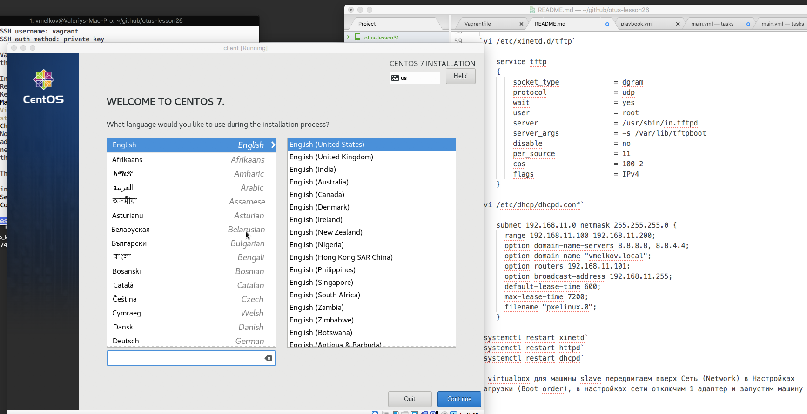

### DHCP, PXE

Домашнее задание
Настройка сервера установки дистрибутива  
Цель: Для того чтобы повторить какие компоненты используются и самостоятельно пройти все этапы установки.

-   Следуя шагам из документа установить и настроить загрузку по сети для дистрибутива CentOS8
    <https://docs.centos.org/en-US/8-docs/advanced-install/assembly_preparing-for-a-network-install>
-   настроить установку из репозитория HTTP
-   настроить автоматическую установку для созданного kickstart файла
    Критерии оценки: задание выполнено успешно если в результате выполнения vagrant up стартует сервер PXE который можно использовать для установки
-   ссылка на репозиторий github.
-   Vagrantfile с шагами установки необходимых компонентов
-   исходный код scripts для настройки сервера (если необходимо)
-   если какие-то шаги невозможно или сложно автоматизировать, то инструкции по ручным шагам для настройки

* * *

В связи с большим объемом необходимых для автоматического развертывания данных инструкция будет только в текстовом варианте, никакой автоматизации  

* * *

На сервере устанавливаем необходимый софт:  
`yum install dhcp httpd tftp-server xinetd syslinux`

Скачиваем и заливаем любым способом iso-образ установочного диска  
(пример заливки образа: `ansible -m copy -a "src=~/Downloads/netinstall.iso dest=/home/vagrant/netinstall.iso"`)  

далее монтируем образ  
`mount -o loop,ro -t iso9660 /home/vagrant/netinstall.iso /mnt/`  

создаём директорию в www и копируем туда файлы  
`mkdir /var/www/centos7/`
`cp -a /mnt/* /var/www/centos7/`
`chmod -R 755 /var/www/centos7/`  

редактируем настройку httpd для этой директории  
`cat /etc/httpd/conf.d/pxe.conf`

    Alias /centos7 /var/www/centos7/
    <Directory /var/www/centos7/>
    Options Indexes FollowSymLinks
    Order Deny,Allow
    Allow from all
    </Directory>

производим настройку tftp  

`cp -a /usr/share/syslinux/* /var/lib/tftpboot/`
`mkdir /var/lib/tftpboot/centos7`
`cp /mnt/images/pxeboot/vmlinuz  /var/lib/tftpboot/centos7`
`cp /mnt/images/pxeboot/initrd.img  /var/lib/tftpboot/centos7`

и создаем менюшку для нашей загрузки по сети  
`mkdir /var/lib/tftpboot/pxelinux.cfg`

`cat /var/lib/tftpboot/pxelinux.cfg/default`

    default menu.c32
    prompt 0
    timeout 300
    ONTIMEOUT 1

    menu title ########## CentOS 7 PXE Boot Menu ##########

    label 1
    menu label ^1) Install CentOS 7
    menu default
    kernel centos7/vmlinuz
    append initrd=centos7/initrd.img ip=dhcp repo=http://192.168.11.101/centos7 inst.ks=http://192.168.11.101/ks.cfg devfs=nomount

    label 2
    menu label ^2) Boot from local drive
    localboot 0

разрешим tftp  
`cat /etc/xinetd.d/tftp`

    service tftp
    {
        socket_type             = dgram
        protocol                = udp
        wait                    = yes
        user                    = root
        server                  = /usr/sbin/in.tftpd
        server_args             = -s /var/lib/tftpboot
        disable                 = no
        per_source              = 11
        cps                     = 100 2
        flags                   = IPv4
    }

настроим dhcp  
`cat /etc/dhcp/dhcpd.conf`

    subnet 192.168.11.0 netmask 255.255.255.0 {
      range 192.168.11.100 192.168.11.200;
      option domain-name-servers 8.8.8.8, 8.8.4.4;
      option domain-name "vmelkov.local";
      option routers 192.168.11.101;
      option broadcast-address 192.168.11.255;
      default-lease-time 600;
      max-lease-time 7200;
      filename "pxelinux.0";
    }

стартуем все сервисы  
`systemctl restart xinetd`  
`systemctl restart httpd`  
`systemctl restart dhcpd`

* * *

В virtualbox для машины slave передвигаем вверх Сеть (Network) в Настройках загрузки (Boot order), в настройках сети отключим 1 адаптер и запустим машину  
Для нормальной установки необходимо выделить виртуальной машине > 2048Мб памяти

* * *

kikstart файл не прилагаю, так как нет времени его создавать - ещё куча домашек) -  в меню запуска установки есть опция для его использования: `inst.ks=http://192.168.11.101/ks.cfg`  
и только сейчас заметил, что нужно было использовать дистрибутив CentOS 8 - принципиальной разницы между 7 и 8 я не вижу  
Список исользованной литературы:  
для CentOS 7: <https://docs.centos.org/en-US/centos/install-guide/pxe-server/>  
для CentOS 8: <https://docs.centos.org/en-US/8-docs/advanced-install/assembly_preparing-for-a-network-install/>

Скриншот загрузки установки:  

## Спасибо за проверку!
